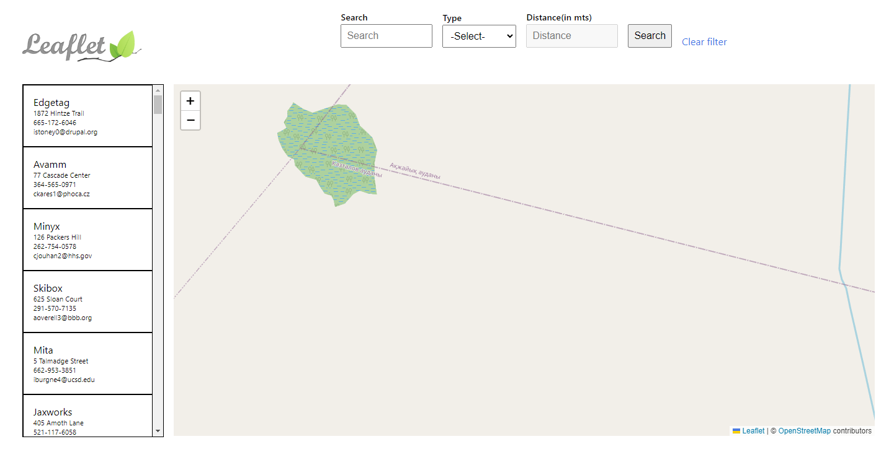

# Location-Based Service Project

## Description

This project is a location-based service utilizing Spring Boot for the backend, ReactJS for the frontend, LeafletJS for mapping, and PostgreSQL with PostGIS for storing geo-locations. The project is configured using Gradle as the build tool. It serves as a demonstration of integrating ReactJS and LeafletJS, showcasing the extensive capabilities of LeafletJS.

## Table of Contents

- [Installation](#installation)
- [Usage](#usage)
- [Features](#features)
- [Contributing](#contributing)
- [Support](#support)
- [Acknowledgements](#acknowledgements)
- [Roadmap](#roadmap)
- [Author](#author)
- [Project Status](#project-status)

## Installation

[Add installation instructions here, including prerequisites and step-by-step setup for both backend and frontend. For instance: Installation could involve cloning the repository, setting up the database, installing dependencies, and running the application.]
Requirement
- JDK 17
- Node 20.4.0
- NVM 1.1.11
- Docker
- Docker Compose v2.2.1

###Steps to execute application

1. Clone git repository using following command 

```
 git clone https://github.com/ankith10ar/LocationBasedService.git
```

2. Open a terminal and set username and password as environment variables by using following command

```
**Windows**
set LBS_USER=<username>
set LBS_PASSWORD=<passsword>

**Linux**
export LBS_USER=<username>
export LBS_PASSWORD=<password>
```

3. Using same terminal execute following command in project root folder

```
docker compose up d 
```

4. Using same terminal execute following command to start the application

```
**Windows**
.\gradlew.bat bootRun

**Linux**
./gradlew bootRun
```

5. Open http://localhost:8080 link in browser

## Usage

[Provide details on how to use the project. Include instructions on interacting with the map, setting the user's location, searching for various places such as Hospitals, Malls, Banks, applying filters by type and distance, and utilizing the additional text search functionality.]

Once you start the application open the application link on browser you will see following screen



####About UI
- On left navbar user can view all locations in the area and on the right side user can view it in map.
- On top, we can find 3 input boxes 
  - The first one is to filter locations via text
  - Second one is to filter locations via type 
  - Third is to filter locations via distance from user location
- The filter via distance is disabled by default and only will be activated when user adds current location
- User can add current location by holding CTRL key and left-clicking anywhere on map
- User has to click on search button to actually filter locations 
- User can click clear filter hyperlink to clear all filters 
- Each type of location is marked with a different color and icon 


####Instructions to navigate map
1. Use scroll wheel to zoom in and out of map 
2. Left click and drag mouse to pan the map 
3. User can click on any location on left navbar and the map will automatically move to that location
4. Inversely, user can click on any location on map the left nav bar will automatically scroll to the location details  


## Features

- Utilizes Spring Boot for backend services
- Integrates ReactJS for the frontend
- Demonstrates extensive use of LeafletJS capabilities
- Stores and manages geo-locations using PostgreSQL with PostGIS
- Supports setting the user's current location
- Enables searching for various locations (Hospitals, Malls, Banks, etc.)
- Allows filtering by location type and distance
- Additional text search functionality

## Contributing

First, thank you for considering contributing to the Location-Based Service Project. Your contributions help make this project better.

### How to Contribute

#### Reporting Issues

If you encounter any issues with the project or have suggestions for improvements, please feel free to open an issue on the GitHub repository. When reporting issues, please provide as much detail as possible, including steps to reproduce the problem, expected behavior, and any relevant error messages.

#### Making Changes

If you want to contribute directly to the codebase, follow these steps:

1. Fork the repository.
2. Create a new branch for your feature or bug fix: `git checkout -b feature-branch-name`.
3. Make your changes and commit them: `git commit -m "Your message here"`.
4. Push your changes to your fork: `git push origin feature-branch-name`.
5. Open a pull request on the GitHub repository.

#### Pull Request Guidelines

To ensure that your pull request is accepted promptly, please follow these guidelines:

1. Provide a clear and descriptive title for your pull request.
2. Explain the purpose of your changes in the description.
3. Ensure your code follows the project's coding standards and conventions.
4. Include relevant tests if applicable.
5. Update the README file if your changes impact its content.

#### License

This project is currently not licensed. You are free to use, modify, and distribute the code. However, if you contribute to this project, your contributions will be subject to the same non-licensing terms.

Thank you for your contribution!

## Support

If you encounter any issues or have questions about using the Location-Based Service Project, please open an issue on the GitHub repository. The issue tracker is the primary means of support for this project.

### How to Report Issues

1. Go to the [GitHub Issues](https://github.com/ankith10ar/LocationBasedService/issues) page.
2. Click on the "New Issue" button.
3. Choose the type of issue you are reporting (bug report, feature request, etc.).
4. Fill out the issue template with as much detail as possible, including steps to reproduce the problem.

The community and maintainers will do their best to address your concerns and provide assistance through the issue tracking system.

Please be patient and respectful while waiting for a response. Your contributions to issue tracking are valuable and help improve the project for everyone.

Thank you for your understanding and support!

## Acknowledgements

- [LeafletJS](https://leafletjs.com/)
- [ByteByteGo](https://www.youtube.com/@ByteByteGo) - [FAANG System Design Interview: Design A Location Based Service (Yelp, Google Places)](https://www.youtube.com/watch?v=M4lR_Va97cQ)
- [Baeldung](https://www.baeldung.com)
- [StackOverFlow](https://stackoverflow.com)
- [Mockaroo](https://www.mockaroo.com)
- [Docker PostGIS](https://registry.hub.docker.com/r/postgis/postgis/)
- [ChatGPT](https://chat.openai.com/)

## Roadmap

[Outline future features or updates planned for the project.]

The Location-Based Service Project is a work in progress, and we have a couple of ideas in mind for future enhancements. However, nothing is planned or scheduled at the moment. The project roadmap may include, but is not limited to, the following ideas:

1. **Enhanced Search Functionality:** Improve and expand the text search functionality to provide more accurate and comprehensive results.

2. **User Location:** Implement the ability to use user's current location from browser APIs.

3. **Mobile Responsiveness:** Optimize the project for mobile devices, ensuring a seamless and user-friendly experience on smaller screens.

4. **Geolocation Clustering:** Explore and implement clustering algorithms for improved performance when displaying a large number of markers on the map.

These are just initial ideas, and the roadmap is subject to change based on community feedback and contributions. Feel free to open issues or contribute to discussions if you have suggestions or would like to see specific features implemented.

## Author

**Ankith Reddy**

- GitHub: [github.com/ankith10ar](https://github.com/ankith10ar)
- LinkedIn: [linkedin.com/in/ankith10reddy](https://www.linkedin.com/in/ankith10reddy)

Feel free to reach out if you have any questions, feedback, or just want to connect! Contributions and collaborations are always welcome.

## Project Status

The project is currently in development and open for contributions.

